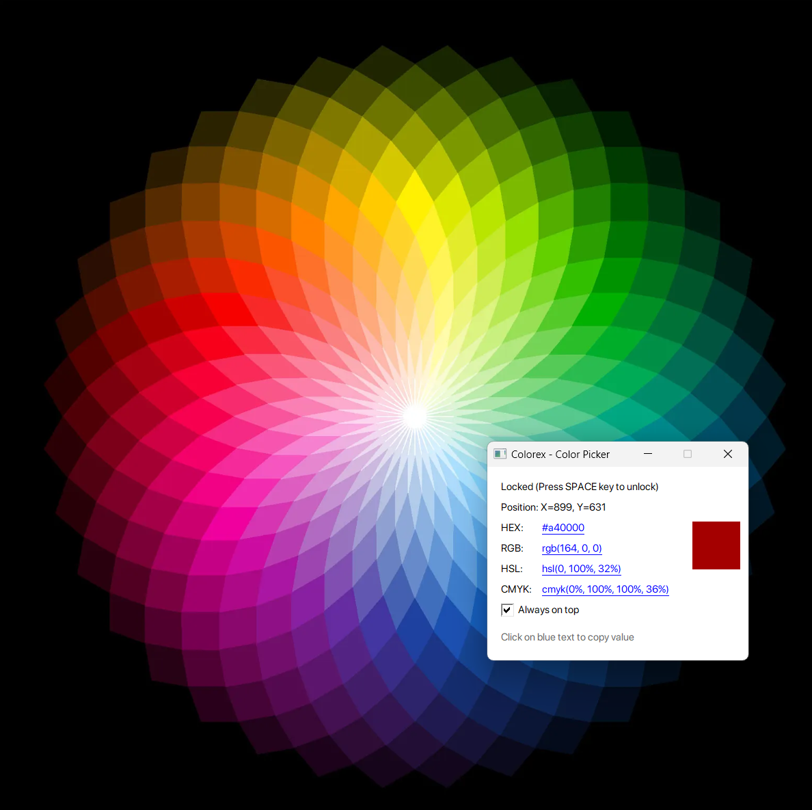

# Colorex C++

#### This is the C++ 20 Windows implementation of the colorex project I developed with Go.
https://github.com/seukaiwokeo/colorex

A simple color picker utility for Windows that allows you to get the color of any pixel on your screen.

#### The app.manifest file has been included to ensure DPI awareness. Otherwise, coordinates will not function correctly on monitors using custom screen scaling.

## Features

- Real-time color picking by hovering over any pixel on the screen
- Displays color in multiple formats (HEX, RGB, HSL, CMYK)
- Displays cursor position
- Toggle color picking with space key
- Color preview



## Building for VS22

```bash
mkdir build && cd build
cmake -G "Visual Studio 17 2022" -A x64 ..
```

## License

[MIT](https://choosealicense.com/licenses/mit/)
